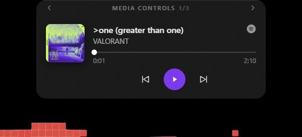
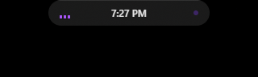
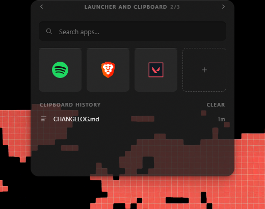
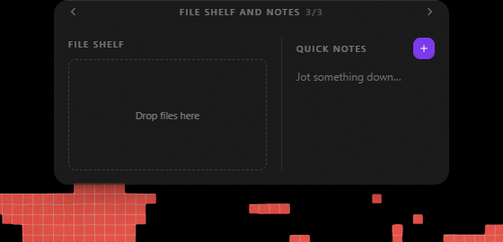

<div align="center">


# Crest

**The dynamic notch, built for Windows.**

Crest hides a Mica-glass panel at the top of your screen. Nudge it and your
music, your apps, your clipboard, your files and your notes slide down. Move
away and the desktop is yours again.

[](https://github.com/LennyDany-03/Dynamic-Notch/releases)
[-0ea5e9?style=flat-square)](https://github.com/LennyDany-03/Dynamic-Notch/releases/latest)
[](https://tauri.app)
[](#license)

**[Download the installer](https://github.com/LennyDany-03/Dynamic-Notch/releases/latest)**



</div>

---

## What it is

Crest draws its own notch. You do not need a laptop that has one — the app is a
transparent, always-on-top window pinned to the top-centre of your screen, so it
works on any monitor, including a desktop tower with no notch in sight.

At rest it is a small pill showing the clock and an equalizer:

<div align="center">
  
</div>

Move the cursor into it and it expands into a card; move away and it collapses.
It has no taskbar button, does not appear in Alt-Tab, and is click-through
everywhere it is not actually drawing, so a click meant for the window
underneath reaches the window underneath.

## The panels

Each panel is a page of the same card. Arrows either side of the title move
between them and the card morphs to fit — it never collapses and reopens.

| Panel | What it does |
|---|---|
| **Now playing** | Reads the Windows media session directly, so whatever is playing shows up — Spotify, a YouTube tab, a local file. Album art, a live scrub bar, and transport controls that actually control it. |
| **Quick launcher** | Every installed app, indexed once and searched fuzzily. Start typing and the results take over the card. |
| **Clipboard history** | The last things you copied, kept where the cursor already is. Click one to put it back on the clipboard. |
| **File shelf** | Drag a file to the top of the screen and the shelf opens to meet it. Park things there while you move between apps, then drag them straight back out. |
| **Quick notes** | A scratchpad one hover away that saves as you type. No file, no save button, no window to find again. |

<table>
<tr>
<td width="50%" align="center">

<br /><sub>Launcher and clipboard</sub>
</td>
<td width="50%" align="center">

<br /><sub>File shelf and notes</sub>
</td>
</tr>
</table>

A tray icon jumps straight to any panel and holds the rest: start with Windows,
check for updates, quit, and **Settings** — where you can keep the notch pinned
on screen and above other windows instead of hiding when the cursor leaves.

## Install

1. Grab `Crest_<version>_x64-setup.exe` from the
   [latest release](https://github.com/LennyDany-03/Dynamic-Notch/releases/latest).
2. Run it. Crest starts immediately and registers itself to start on login.
3. Move the cursor to the top-centre of your screen.

**Requirements:** Windows 10 or 11, x64. Later versions install from inside the
app — **Check for updates** in the tray menu downloads and applies them in
place, so you only need this page once.

To remove it, uninstall from Windows Settings like any other app; the auto-start
entry goes with it.

## Using it

| Action | Result |
|---|---|
| Move the cursor to the top-centre | The pill appears |
| Rest there for 600 ms | The card expands |
| Move away | It collapses after a 300 ms grace period |
| Arrows either side of the title | Move between panels |
| Drag a file to the top of the screen | The shelf opens to catch it |
| Right-click the tray icon | Panels, Settings, and quit |

## Two projects, one repository

This repo holds the app and its marketing site. They share a git history and
nothing else — separate `package.json`, separate `node_modules`, separate
`tsconfig.json`.

| Path | What | Stack |
|---|---|---|
| `product/` | **Crest** itself | Tauri 2 (Rust) + React 19 + Vite + Framer Motion |
| repo root (`app/`, `components/site/`, `lib/`) | The marketing site | Next.js 16 App Router, React 19, Tailwind 4 |

The root tooling deliberately excludes `product/`, so a root-level `npm run lint`
or `tsc` tells you nothing about the app, and vice versa. Run `npm install` in
each directory you intend to work in.

## Build from source

**Prerequisites:** [Rust](https://rustup.rs) · [Node 18+](https://nodejs.org) ·
[Tauri CLI v2 prerequisites](https://tauri.app/start/prerequisites/)

```bash
git clone https://github.com/LennyDany-03/Dynamic-Notch.git
cd Dynamic-Notch/product
npm install

npm run tauri dev      # the full app — Vite on :1420 plus the Rust backend
npm run tauri build    # installers → src-tauri/target/release/bundle/
```

`npm run build` in `product/` is `vite build` alone — there is no `tsc` step, so
type errors will not fail it. Check types explicitly:

```bash
npx tsc --noEmit
```

### Without rebuilding Rust

`useHotzone` detects Tauri through `window.__TAURI_INTERNALS__` and falls back to
DOM `mousemove` when it is absent, so plain `npm run dev` in a browser exercises
the whole state machine and all the UI, with the viewport standing in for the
screen. Anything that calls `invoke()` — media, launcher, clipboard, shelf,
notes — will not work there.

### The marketing site

```bash
npm install     # from the repo root
npm run dev     # localhost:3000
npm run build
npm run lint
```

There is no test suite in either project.

## How it is put together

[`product/Architecture.md`](product/Architecture.md) is the long-form design
record and explains the decisions that look wrong out of context. The short
version:

- **The OS window is never resized.** The overlay is a fixed 560×420 transparent
  window; the cards animate *inside* that canvas. Spring-resizing a transparent
  always-on-top window on Windows makes `backdrop-filter` re-sample every frame
  and tear.
- **Cursor position is polled from the OS, not read from DOM events.** The
  window ignores cursor events whenever the cursor is not over card content, so
  the webview receives no mouse events at all.
- **`product/src/layout.ts` is the single source of geometry**, read by both the
  state machine and the renderer, so the visible card and the interactive bounds
  cannot drift apart.
- **One state machine owns visibility.** No component decides whether it is
  shown:

  ```
  hidden ──cursor in hotzone──▶ peek ──600ms dwell──▶ expanded
         ◀──300ms grace───────       ◀──300ms grace──
  ```

- **Three windows share one bundle** — the notch, the tray menu and Settings are
  chosen by window label at mount. The tray menu is a real webview rather than a
  native Win32 menu, which cannot be Mica-styled.
- **Every native call is a registered Tauri command** in `src-tauri/src/lib.rs`,
  one module per feature area. Hooks in `product/src/hooks/` are the only callers
  of `invoke`; components take state as props.

## Releasing

Releases are tag-triggered, never push-triggered — every run of
[`.github/workflows/release.yml`](.github/workflows/release.yml) becomes an
update prompt on someone's machine. [`Release.md`](Release.md) has the full
procedure. In short:

1. Bump `version` in `product/src-tauri/tauri.conf.json` — the only number the
   updater compares.
2. Bump `version` in `lib/site.ts` to match, or the site's download button 404s.
3. Add a `## <version>` section to [`CHANGELOG.md`](CHANGELOG.md). The workflow
   uses it as the release body and fails the build if it is missing. The site's
   "What's new" dialog reads the same file.
4. `git tag vX.Y.Z && git push origin main --tags`.

## Contributing

Issues and pull requests are welcome. For anything structural, read
[`product/Architecture.md`](product/Architecture.md) first — several of the
constraints there exist because the obvious approach was tried and produced
visible tearing or a notch that collapsed mid-click.

## License

MIT.

---

<div align="center">

Built by [LennyDany-03](https://github.com/LennyDany-03) · Not affiliated with
Microsoft or Apple.

</div>
